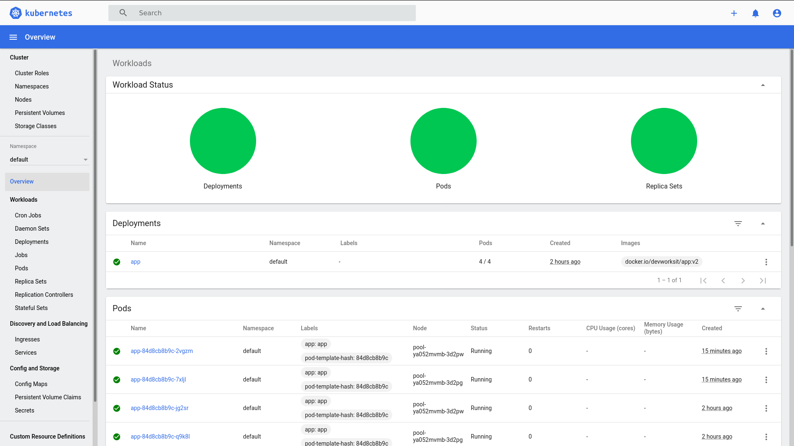

# Kubernetes

## Development
```
$ docker-compose -f docker-compose-dev.yml up --build
```

## Docker Image
```
$ docker build -t devworksit/app .
$ docker login
$ docker push devworksit/app
```

## Digital Ocean
```
$ export KUBECONFIG=$KUBECONFIG:$HOME/.kube/digital-ocean-k8s-kubeconfig.yaml
$ kubectl get nodes
```

## Deployment
```
$ kubectl apply -f .k8s/deployment.yaml
$ kubectl get pods
```

## Service
```
$ kubectl apply -f .k8s/service.yaml
$ kubectl get services
```

## Dashboard
```
$ kubectl apply -f https://raw.githubusercontent.com/kubernetes/dashboard/v2.0.0/aio/deploy/recommended.yaml
$ kubectl apply -f .k8s/admin-user.yaml
$ kubectl apply -f .k8s/cluster-bind.yaml
$ kubectl -n kubernetes-dashboard describe secret $(kubectl -n kubernetes-dashboard get secret | grep admin-user | awk '{print $1}')
$ kubectl proxy
http://localhost:8001/api/v1/namespaces/kubernetes-dashboard/services/https:kubernetes-dashboard:/proxy/
$ kubectl -n kubernetes-dashboard get serviceaccount
$ kubectl -n kubernetes-dashboard get clusterrolebinding
$ kubectl -n kubernetes-dashboard delete serviceaccount admin-user
$ kubectl -n kubernetes-dashboard delete clusterrolebinding admin-user
```


